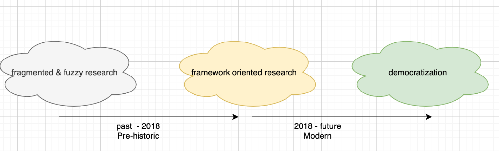
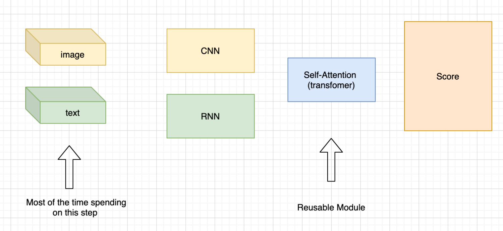

============
Introduction
============

.. contents:: Table of contents

What This Is
============

Wellcome to Denver in Language Understanding! This is a library and a toolbox produced by
NLP Team, Ftech.AI that makes it easier to use about Language Understanding (LU). We present 
the idea of Denver as a flexible, extensible and easy to use toolbox which allows users to 
replicate, training the dialogue related experiments without writing code. Denver implements 
the “well-experimental“ module such as Intent Classification, Named Entity Recognition, FAQ 
with novel approach to deep learning building based on the high level of abstraction: Data 
types and declarative configuration files Data type abstraction allows for reusability of model 
and interface standard. Declarative model definition configuration files enable inexperienced 
users to obtain effective models and increase the productivity of expert users. Alongside 
these two innovations, Denver introduces the unified view of all the deep learning architecture 
called Encoder Fusion Decoder (EFD) that can be instantiated to perform a vast amount of machine 
learning in the dialogue domain. The innovations make it possible for engineers, sale team and 
product team member to adopt deep learning model for their task, replicate and move fast with 
experiments to satisfy fast-growing client 's requirements and data evolution.

Why We Built This
=================
Let’s have a retrospective about the blooming of AI recently and the main workhorse 
behind it: "Deep learning".  Over the course of the last ten years, deep learning models 
have demonstrated to be highly effective in almost every machine learning task in different 
domains including (but not limited to) computer vision, natural language, speech, and recommendation.
The wide adoption in both research and industry has been boosted by sophisticated software libraries 
such as Theano , TensorFLow, Keras, pytorch. Their main value has been to provide tensor 
algebra primitives with efficient implementations which, together with the massively parallel 
computation available on GPUs, enabled researchers to scale training to bigger datasets. 
Those software provided the standard implementation of automatic “gradient calculation“ 
which greatly simplified the model implementation Researchers do not need to spend time 
re-implementing these basic building blocks from scratch and now having fast and reliable 
implementations of the same, were able to focus on models and architectures, which lead 
to the first wave of deep learning exposure. However; when coming to commercialized software, 
it is very difficult for researchers to deliver the product-ready software. not to mention, 
it is a really time consuming process if the researchers need to handle all the tasks 
from data preparation to model delivery. We claim that the second wave of deep learning 
expose should make it a democratization in which software developer, business analytics 
and broader audience to adopt the technology.

  
The outspread of application of artificial neural network architectures in a wide variety of 
tasks encourage the common practices regarding how to handle certain types of input 
information emerged. In other words, we got a more “unified“ view about the fundamental tasks in ML
We claim that when modeling a particular data for a particular task the model architectures are 
unchanged while practitioners focus mainly for “data interfacing“. take an example in 
computer vision task and natural language processing task as an example to prove this 
observation. When faced with a computer vision problem, a practitioner preprocesses 
data using the pipeline that resizes images, augments them with some transformation 
and maps them into 3D tensors. Something similar happens for text data, where text 
is tokenized either into a list of words or characters or word pieces, a vocabulary with 
associated numerical IDs is collected and sentences are transformed into vectors of integers
Denver, a deep learning toolbox that encapsulates the above idea, aims to provide the best 
practices from the internal team’s research work and take advantage of inheritance of code 
modularity. Denver makes it much easier for practitioners to compose their deep learning models 
by just declaring their data and task and to make code reusable, extensible and favor best practices.

Architecture
=================
In Denver, every model is defined in terms of encoders that encode different features of an input 
data point, a combiner which combines information coming from the different encoders, 
and decoders that decode the information from the combiner into one or more output features. 
This generic architecture is referred to as Encoders-Fusion-Decoders (EFD).

.. image:: ../_static/efd.png
  :width: 800
  :alt: Alternative text

This architecture is introduced because it maps naturally most of the architectures of deep learning m
odels and allows for modular composition. This characteristic, enabled by the data type abstraction, 
allows for defining models by just declaring the data types of the input and output features involved 
in the task and assembling standard sub-modules accordingly rather than writing a full model from scratch.
